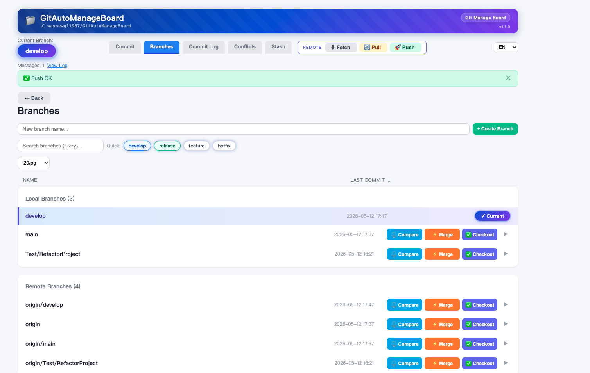
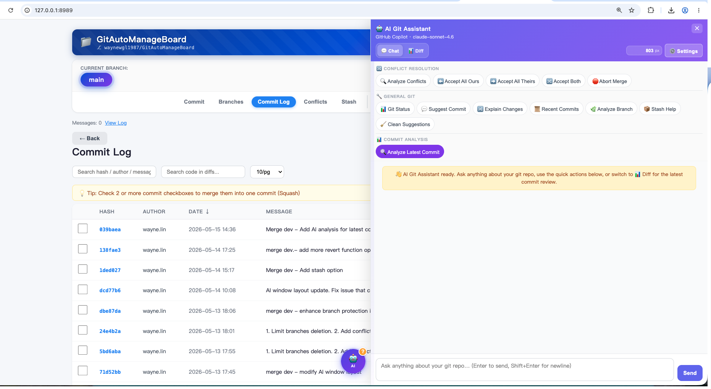
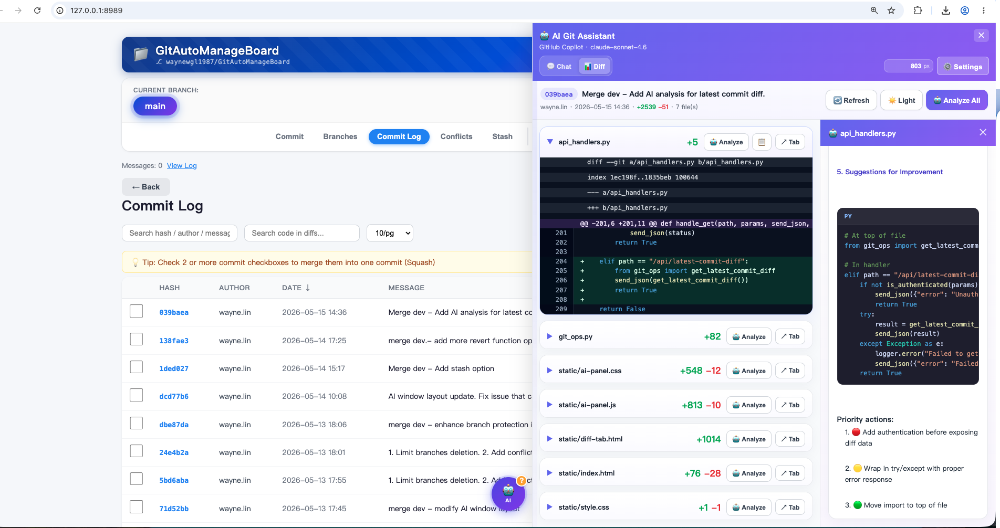

<div align="center">

# 🛠️ GitAutoManageBoard

**A lightweight, browser-based Git management dashboard with built-in AI assistant — no installation required.**

一个轻量级、基于浏览器的 Git 可视化管理面板，内置 AI 智能助手，无需安装，开箱即用。

[](https://python.org)
[]()
[]()
[](LICENSE)

[English](#english) · [中文](#中文)

</div>

---

## English

### What is this?

**GitAutoManageBoard** is a single-file Python script that launches a local web server and opens a full-featured Git dashboard in your browser. It wraps common `git` commands into an intuitive UI — and adds an **AI Git Assistant** powered by Claude, GPT, Gemini, or any OpenAI-compatible model — perfect for developers who want a faster, visual alternative to the command line for daily Git operations.

No frameworks, no npm, no Docker. Just Python 3 and a modern browser.

---

### 📸 Preview

#### Git Management Board

> Branches page — local & remote branches with Compare / Merge / Checkout actions, fuzzy search, quick-filter tags, and sortable columns.



#### 🤖 AI Git Assistant — Chat Mode

> AI panel open alongside the Commit Log. Quick-action groups (Conflict Resolution, General Git, Commit Analysis) let you analyze, suggest, or explain with one click.



#### 🤖 AI Git Assistant — Diff Mode

> AI Diff tab: per-file code diff viewer with inline **Analyze** buttons. The right side panel shows AI-generated suggestions (e.g., security issues, refactoring tips) for each changed file.



---

### ✨ Features at a Glance

| Tab / Area | What you can do |
|-----------|----------------|
| **Commit** | Stage / unstage files, view inline diffs, write commit messages, commit with one click. Manage `.gitignore` entries. |
| **Branches** | View local & remote branches, create branches, switch branches, delete local/remote branches (with safety guards), fuzzy search, pagination, sort. |
| **Compare** | Side-by-side branch comparison — visual diff, file-by-file navigation, swap branches, one-click merge. |
| **Merge** | Squash-merge any branch into the current branch with a custom commit message and conflict warnings. |
| **Commit Log** | Browse full history. Search by hash / author / message / code-in-diffs. Soft/Hard reset, revert, squash commits. Restore individual files to any historical version. |
| **Conflicts** | Visual conflict resolution with collapsible context blocks, resolved banners, step-by-step dialogs to commit and push after resolution. |
| **Stash** | List, inspect, pop, or drop stash entries. Pagination support. |
| **Remote** | Fetch, Pull, Push — all with live streaming log popups. Force push with `--force-with-lease`. Auto SSH/HTTPS switching. |
| **🤖 AI Assistant** | Floating AI chat panel — ask anything about your repo. Auto-injects live page context. **Chat mode** quick actions: analyze conflicts, accept ours/theirs/both, abort merge, suggest commits, explain diffs, recent commits, analyze branch, stash help, clean suggestions. **Diff mode**: per-file code diff with inline Analyze buttons and AI suggestion panel. Supports Claude, GPT-5, Gemini, DeepSeek, Qwen, Ollama. |
| **Config** | Customise app name and version via `config.ini`. |

---

### 🚀 Quick Start

#### Prerequisites

- Python 3.6 or later
- Git installed and available in your `PATH`
- A terminal opened **inside the repository** you want to manage

#### Run

```bash
# Navigate to the target git repository first
cd /path/to/your/git/repo

# Then run the tool
python3 /path/to/git_commit_tool.py
```

The browser will open automatically at `http://127.0.0.1:8989`.  
If port `8989` is busy, the tool auto-increments to the next available port.

---

### 📖 Detailed Feature Guide

#### 1 · Commit Tab

The default landing page. Shows all **unstaged and staged changes** in your working tree.

- Each changed file is displayed as a collapsible card with a **colored diff** (green = additions, red = deletions).
- **Check / uncheck** individual files to include or exclude them from the commit.
- **Select All / Deselect All** checkbox for bulk operations.
- Type your commit message and click **Confirm Commit**.
- After a successful commit, a modal offers to **push to remote** immediately.
- ⚠️ **Protected Branch Warning** — committing directly to `main`, `master`, `develop`, or `release` triggers a confirmation dialog to prevent accidental commits to shared branches.

**Gitignore Management:**
- Click the **📋 Gitignore** button at the bottom toolbar to view and manage entries in `.gitignore`.
- Each file card has an **Ignore** button to quickly add a file pattern to `.gitignore`.
- In the Gitignore modal, click **+ Re-add** on any entry to remove it from `.gitignore` and resume tracking.

**Pull before commit workflow:** If there are uncommitted changes when pulling, the UI offers three options:
- **📦 Stash & Pull** — stash changes, pull, then manually restore from Stash tab.
- **⬇️ Pull Anyway** — pull without touching local changes (may cause conflicts).
- **Cancel** — do nothing.

---

#### 2 · Branches Tab

Manage all local and remote branches in one place.

- **Local branches** listed first, sorted by most recent commit date. Current branch highlighted in blue gradient.
- **Remote branches** paginated (10 / 20 / 50 / 100 / 200 / 300 per page, or load all).
- **Column sort** — click **Name** or **Last Commit** header to sort ascending/descending.
- **Create Branch** — type a name and optionally base it on another branch. After creation, a modal offers to **push to remote** immediately.
- **Switch Branch** — click any branch name. If uncommitted changes exist, a modal prompts to **stash** them first, then switch. After switching with stash, you can choose to **apply stash** to the new branch or keep it for later.
- **Fuzzy Search** — type to filter branches by name. Quick-filter tags for `develop`, `release`, `feature`, and `hotfix` prefixes.

**Per-branch actions (click ▶ to expand a branch row):**
- ⚖️ **Compare** — opens the Compare page with this branch as Branch A.
- ⚡ **Merge** — squash-merge this branch into the current branch.
- ✅ **Checkout** — switch to this branch.
- 🗑 **Delete Branch** — hidden inside the expandable panel to prevent accidental clicks.

**Delete Branch flow:**
1. Click **▶** at the right edge of any branch row to expand its action panel.  
   Opening one row **automatically collapses** all others.
2. Click **🗑 Delete Branch** — a modal asks whether to delete the **local** or **remote** branch.
3. **Local delete:** Runs `git branch -d` (safe delete — aborts if not fully merged). If the branch is **not fully merged**, an amber warning appears offering **Force Delete** (`git branch -D`).
4. **Remote delete:** Shows a **🚨 IRREVERSIBLE** warning modal, then a second confirmation before proceeding. Deletion progress is displayed in a **terminal-style log popup**.

---

#### 3 · Compare Page

Side-by-side comparison of any two branches — local or remote.

- Select **Branch A** and **Branch B** from dropdowns, each toggleable between **Remote** and **Local** sources.
- **⇄ Swap** button exchanges Branch A and Branch B instantly.
- **Summary bar** shows file count, total additions/deletions, and unique commit count for Branch A.
- **Left sidebar** — clickable file list with +/- stats. Click any file to scroll to its diff.
- **Right panel** — per-file diffs with collapsible sections, colored additions/removals.
- **Raw command & cwd** displayed at the bottom for transparency (`$ git diff head...base`).
- If branches are identical, a clear "no unique changes" message is shown.
- **⚡ Merge** button — merges Branch A into Branch B. If needed, auto-checks-out Branch B first.

---

#### 4 · Merge (from any branch)

Accessible from the **Branches** or **Compare** page via the ⚡ Merge button.

- Opens a detailed warning modal explaining which branch merges into which, that all commits will be **squashed into one**, and that conflicts will need to be resolved.
- Enter a **custom commit message** (required).
- Click **Merge Now** — the tool performs a squash-merge (`git merge --squash`) and commits.
- On success, offers to **push** to remote immediately.
- If conflicts occur, redirects to the Conflicts tab for resolution.

---

#### 5 · Commit Log Tab

Explore the full commit history of the current branch.

- **Search bar** filters commits by hash, author name, or commit message simultaneously.
- **Code diff search** — search for a regex pattern inside actual diff content (uses `git log -G`). Matching commits are highlighted.
- **Pagination** — 1 / 5 / 10 / 20 / 50 / 100 / 300 per page, or load all.
- **Sort order** — toggle ascending / descending by timestamp.
- **Root commit** indicators — initial commits are flagged so you know which ones cannot be squashed.

**Per-commit actions:**
- Click a commit row to **expand/collapse** its full file diff.
- Click the hash to toggle between short (7-char) and full 40-char SHA.
- 🔁 **Revert** — create a new commit that undoes the selected commit (history preserved).
- ↩️ **Soft Reset** — move HEAD back to that commit, keep changes staged.
- 💥 **Hard Reset** — move HEAD back and discard all subsequent changes.
- 📂 **Restore file** — opens the Restore File page for any file changed in that commit.

**Squash (merge commits):**
- Check 2+ commit checkboxes to enable the **Squash** bar.
- Enter a new commit message and click **Squash** to merge them into one (`git reset --soft` + new commit).
- Root commits cannot be squashed. ⚠️ Protected branch warning applies on shared branches.
- After a successful squash on a protected branch, a **Force Push** option is offered.

**Reset Conflict State:** Click **Reset Conflict State** to abort any ongoing merge / rebase / cherry-pick and return to the last clean commit.

---

#### 6 · Restore File Page

Accessible from the Commit Log — restore any file to a specific historical version.

- Displays the target file path and commit version.
- Browse the file's **commit history** (paginated), with per-commit diffs showing only that file's changes.
- Click **Restore to this** on any commit to overwrite the current working copy with that version.
- A confirmation modal warns before proceeding.

---

#### 7 · Conflicts Tab

Triggered automatically when a merge, rebase, or cherry-pick produces conflicts.

- Lists every conflicted file. **Auto-expand** the first file on load.
- Expand a file to see **conflict zone rendering**:
  - **Ours** (current branch, green panel) vs **Theirs** (incoming, blue panel).
  - **Context blocks** (non-conflict surrounding code) are **collapsed by default** (▶) to keep the view clean.
- Each conflict block can be resolved independently:
  - ✅ **Use Ours** — accept the current branch version.
  - 🔵 **Use Theirs** — accept the incoming version.
  - ✏️ **Edit manually** — write a custom resolution in a textarea. Click **Save this block** to apply.
- Once resolved, a **gradient "RESOLVED" banner** replaces that block as a clear visual indicator.
- A **jump bar** (◀ Prev / Next ▶) navigates between multiple conflict blocks in the same file.
- **📝 Edit raw file** — open the entire file in a raw text editor for manual resolution.

**💾 Save & Resolve File flow:**
1. Click **Save & Resolve** after resolving all blocks in a file.
2. If any block is **still unresolved**, a warning modal appears (cancel to go back and resolve them).
3. After the last conflict file is resolved, a **commit dialog** appears — enter a message and confirm to auto-commit the merge.
4. After commit, a **push dialog** asks whether to push immediately.

---

#### 8 · Stash Tab

- Lists all stash entries with index, message, and a **diff preview**.
- **Pop** — apply the stash back and remove it from the stack.
- **Drop** — permanently delete a stash entry (with confirmation modal).
- Pagination: 1 / 5 / 10 / 20 / 50 / 100 / 300 per page, or all.

---

#### 9 · Remote Operations (Top Bar)

Three buttons always visible at the top:

| Button | Command | Description |
|--------|---------|-------------|
| ⬇ **Fetch** | `git fetch --all --prune --verbose` | Download remote refs without merging |
| 🔄 **Pull** | `git pull --rebase --verbose` (default) | Sync remote commits to local branch |
| 🚀 **Push** | `git push --verbose --progress` | Send local commits to remote |

All three operations open a **terminal-style streaming log popup** showing live output line by line.

**Pull features:** Three strategies (merge / rebase / fast-forward only). Auto-detects stale upstream and offers a one-click fix. Handles divergent branches with inline strategy selector. Offers **Stash & Retry** when local changes block the pull.

**Push features:** Live streaming output. Auto-retry on no-upstream. Authentication handling with SSH/HTTPS auto-switching or credential prompt. **Force Push** (`--force-with-lease`) when rejected (non-fast-forward).

---

#### 10 · 🤖 AI Git Assistant

A fully integrated AI chat assistant that understands your **live repository context** — always available via the floating **🤖 AI** button in the bottom-right corner.

**Chat Mode** — quick-action buttons grouped by task, free-text chat with full page context auto-injected:


**Diff Mode** — per-file code diff viewer with inline AI analysis and side panel suggestions:


**Opening & closing:**
- Click the **🤖 AI** button (bottom-right) to slide open the chat panel.
- The button automatically **moves left** to sit beside the panel edge when open — click it again to collapse the panel.
- The **`?` badge** on the button makes it immediately recognisable as an interactive entry point.

**Automatic live context injection:**
Every message you send automatically includes:
- Current branch name, project name, and remote URL.
- Current page content (rendered DOM) — whatever is visible on screen.
- Live git status fetched from `/api/files` (changed files + statuses).
- Stash list or conflict file list when you're on those pages.
- Full conflict block content (ours/theirs) when on the Conflicts page.

This means you can simply say *"squash the last 3 commits"* or *"which conflict should I keep?"* and the AI already knows everything it needs.

**Quick action buttons** are organised into three groups:

**Conflict Resolution**

| Button | What it does |
|--------|-------------|
| 🔍 **Analyze Conflicts** | Fetches conflict data and asks the AI to recommend the best resolution strategy for each block. |
| ⬅️ **Accept All Ours** | Resolves all conflicts in all files by accepting the current branch (HEAD) version in one click. |
| ➡️ **Accept All Theirs** | Resolves all conflicts by accepting the incoming version in one click. |
| ⚡ **Accept Both** | Merges both sides of every conflict block, keeping all content. |
| 🛑 **Abort Merge** | Runs `git merge --abort` to cancel the current merge and restore the pre-merge state. |

**General Git**

| Button | What it does |
|--------|-------------|
| 📊 **Git Status** | Fetches current git status and explains each file's state with recommended actions. |
| 💬 **Suggest Commit** | Fetches current changed files and generates a Conventional Commits–formatted commit message. |
| 🔀 **Explain Changes** | Summarises what has changed in the current branch vs its base and describes the impact. |
| 📜 **Recent Commits** | Lists the most recent commits with a concise summary of each change. |
| 🌿 **Analyze Branch** | Explains the purpose and risks of the current branch in a GitFlow workflow. |
| 📦 **Stash Help** | Shows stash list and advises when to pop, drop, or apply stash entries. |
| 🧹 **Clean Suggestions** | Identifies untracked files, stale branches, and recommends cleanup actions. |

**Commit Analysis**

| Button | What it does |
|--------|-------------|
| 🔎 **Analyze Latest Commit** | Switches to Diff mode and runs a full AI code review on the latest commit's diff. |

**Diff Mode:** Click the **📊 Diff** tab in the AI panel header to enter Diff mode. It displays the latest commit's changed files with:
- Per-file `+N / -N` stats and collapsible diff blocks.
- **Analyze** button per file — sends that file's diff to AI for focused review (security, logic, style).
- **Tab** button — opens the file diff in a separate browser tab.
- **Analyze All** — runs AI review across all changed files at once.
- **Light / Dark** toggle for the diff viewer theme.

**Per-conflict AI analysis:** Each conflict block in the Conflicts tab has an **🤖 AI** button that sends that specific conflict to the chat for focused analysis and a recommended resolution.

**Provider & model configuration (⚙️ button in panel header):**

| Provider | Models | Key required |
|----------|--------|-------------|
| **OpenAI** | gpt-4.1, gpt-4o, gpt-4o-mini, gpt-3.5-turbo, o1-mini | Yes |
| **Anthropic** | claude-opus-4.7, claude-sonnet-4.6, claude-haiku-4.5 | Yes |
| **DeepSeek** | deepseek-chat, deepseek-coder, deepseek-reasoner | Yes |
| **Qwen** | qwen-max, qwen2.5-coder-32b-instruct, qwen-plus | Yes |
| **Ollama (Local)** | codellama, llama3, mistral, deepseek-coder-v2, qwen2.5-coder | No — runs locally |
| **Custom** | Any OpenAI-compatible endpoint | Configurable |

All settings are saved to `localStorage`. Use **🔌 Test Connection** to verify credentials before saving.

---

#### 11 · App Branding & Configuration (`config.ini`)

The app name and version displayed in the top-right header can be customised:

```ini
[app]
# Application display name shown in the top-right header
name = Git Manage Board

# Version string shown below the app name
version = v1.1.0
```

Changes take effect on the next page reload (no server restart required).

---

#### 12 · Layout & Navigation

- **Top bar** is a 3-column layout:
  - **Left** — Current Branch name.
  - **Center** — Tab buttons (Commit / Branches / Commit Log / Conflicts / Stash) + REMOTE actions (Fetch / Pull / Push).
  - **Right** — Language selector (EN / 中文).
- **Project name** shown in the purple header as a frosted pill badge, with version below.
- **AI button** floats at bottom-right; slides left to dock beside the AI panel when open.

---

#### 13 · Language Support

Click the **EN / 中文** selector in the top-right corner to switch the entire UI between English and Chinese instantly. The preference is saved in `localStorage`.

---

#### 14 · Message Log

All operation results (commits, pulls, pushes, resets, merges, …) are stored in an in-session memory log.
- Messages appear in the **message area** below the top bar and can be dismissed individually.
- Click **View Log** to browse the full history with timestamps and type badges (success / error / info).
- **Clear All Messages** removes the entire log.

---

### ⌨️ Keyboard & UX Tips

- Press **Enter** in the commit message field to trigger commit.
- Press **Enter** in the AI chat input to send (Shift+Enter for newline).
- The global spinner in the top-center indicates any in-progress API call.
- Toast notifications (top-right) confirm success or failure for every action.
- All diff blocks support horizontal scrolling for long lines.
- The last active tab is **persisted** in `localStorage` and restored on page reload.
- Branch accordion rows: opening one row **auto-closes** others.

---

### 🔒 Security Notes

- The server **binds to `127.0.0.1` only** — it is never exposed to your network.
- Git credentials entered in the push dialog are passed via a temporary shell script and deleted immediately after use.
- Interactive Git prompts are disabled (`GIT_TERMINAL_PROMPT=0`) to prevent subprocesses from hanging.
- AI API keys are stored in `localStorage` in your browser only — never sent to or stored on the local server.

---

### 🗂️ Project Structure

```
GitAutoManageBoard/
│
├── git_commit_tool.py      # Entry point — HTTP server, request routing, static file serving.
│                           # Class Handler (BaseHTTPRequestHandler):
│                           #   do_GET  → serves /static/* files + delegates to handle_get()
│                           #   do_POST → delegates to handle_post()
│                           # main() finds a free port starting at 8989, starts HTTPServer,
│                           # opens the browser automatically.
│
├── git_ops.py              # All Git operations and shared server state.
│                           # Globals: PORT, _MSGLOG (in-session operation log),
│                           #          _PUSH_JOBS (streaming job registry),
│                           #          _PUSH_JOBS_LOCK, _MSGLOG_LOCK (thread safety)
│                           # Core helpers:
│                           #   _get_git_env()          — unified git env (disables prompts)
│                           #   _run()                  — synchronous git subprocess wrapper
│                           #   _run_push_streaming()   — async push with live stdout capture
│                           #   _run_gitop_streaming()  — async fetch/pull with live output
│                           # Domain functions (one per git operation):
│                           #   current_branch, get_status, get_conflicts, get_branches,
│                           #   create_branch, checkout_branch, delete_branch_local/remote,
│                           #   compare_branches, get_commit_log, get_commit_diff,
│                           #   reset_to, revert_commit, squash_commits, restore_file,
│                           #   stash_list/pop/drop, resolve_conflict,
│                           #   pull_current, fetch, push_streaming, abort_merge ...
│
├── api_handlers.py         # REST API endpoint dispatcher (GET + POST).
│                           #   json_result(rc, stdout, stderr) — canonical JSON response builder
│                           #   handle_get(path, params, send_json)  — all GET /api/* routes:
│                           #     /api/files, /api/branches, /api/log, /api/conflicts,
│                           #     /api/stash, /api/compare, /api/project-name,
│                           #     /api/push-status, /api/gitop-status,
│                           #     /api/ai/chat-status
│                           #   handle_post(path, data, send_json)   — all POST /api/* routes:
│                           #     /api/commit, /api/checkout, /api/create-branch,
│                           #     /api/delete-branch, /api/merge, /api/squash,
│                           #     /api/reset, /api/revert, /api/restore-file,
│                           #     /api/resolve-conflict, /api/stash-pop, /api/stash-drop,
│                           #     /api/push, /api/pull, /api/fetch, /api/abort-merge,
│                           #     /api/gitignore-add, /api/gitignore-remove,
│                           #     /api/ai/chat, /api/ai/test-provider
│
├── ai_module/
│   ├── __init__.py         # Package init (empty).
│   │
│   └── ai_provider.py      # Decoupled AI provider submodule.
│                           # Supports: OpenAI-compatible, Anthropic native API, Ollama,
│                           #   DeepSeek, Qwen, and any custom OpenAI-compatible endpoint.
│                           # Public API:
│                           #   call_llm(provider, api_key, base_url, model, messages)
│                           #                            — synchronous LLM call, returns (ok, text)
│                           #   test_provider(...)       — test connectivity for the settings modal
│                           #   start_chat_job(...)      — async LLM call, returns job_id
│                           #   get_job_status(job_id)   — poll async job result
│
├── static/
│   ├── index.html          # HTML skeleton — layout structure, tab panels, modal containers,
│   │                       # AI chat panel HTML, AI floating button (🤖 + ? badge).
│   │                       # References /static/style.css, /static/app.js,
│   │                       # /static/ai-panel.css, /static/ai-panel.js.
│   │
│   ├── diff-tab.html       # Standalone AI Diff tab page — opened in a new browser tab when
│   │                       # the user clicks "Tab" on a file in the AI Diff panel.
│   │                       # Displays a single file's diff with syntax highlighting,
│   │                       # light/dark theme toggle, and copyable diff content.
│   │
│   ├── style.css           # Core UI styles for the Git board.
│   │                       # CSS custom properties (:root) define the design token system:
│   │                       #   --color-primary/success/warning/error/purple,
│   │                       #   --color-text/bg/border, --radius-*, --font-size-*
│   │                       # Sections: layout, top-bar, project banner, tabs, diff viewer,
│   │                       #   branch list, conflict zones, modals, stash, log, toasts,
│   │                       #   restore file page, squash bar, compare page.
│   │
│   ├── app.js              # All client-side JavaScript for the Git board (~2800 lines).
│   │                       # Sections:
│   │                       #   i18n       — T{} translation table (EN/ZH), t()/tf() helpers,
│   │                       #               switchLang(), data-i18n attribute auto-apply
│   │                       #   State      — global UI state (checkedPaths, resolvedConflicts,
│   │                       #               _conflictData, pagination state ...)
│   │                       #   API        — apiGet(), apiPost(), global spinner management
│   │                       #   Pages      — switchPage(), loadFiles(), loadBranches(), loadLog(),
│   │                       #               loadConflicts(), loadStash(), loadProjectName(),
│   │                       #               loadCompare(), loadMsgLog()
│   │                       #   Git ops    — doFetch(), doPull(), doPush(), doManualPush(),
│   │                       #               checkoutBranch(), createNewBranch(), deleteBranch(),
│   │                       #               mergeSquash(), doSquash(), doReset(), doRevert(),
│   │                       #               resolveAllBlocks(), saveAndResolveFile(),
│   │                       #               loadStashList(), popStash(), dropStash()
│   │                       #   UI helpers — showModal(), showModalDouble(), showToast(),
│   │                       #               addMsg(), highlightDiff(), renderConflictZone(),
│   │                       #               renderDiff(), buildPagination()
│   │                       #   Syntax HL  — _tokenLine(), buildHighlightedPre() for 10+ languages
│   │
│   ├── ai-panel.css        # Styles for the AI chat panel and floating action button.
│   │                       # Key sections:
│   │                       #   #ai-fab             — floating 🤖 button with "?" badge,
│   │                       #                         transition: right for panel-open slide
│   │                       #   #ai-fab.panel-open  — moves FAB left to dock beside panel
│   │                       #   #ai-chat-panel      — 400px right-side slide-in panel
│   │                       #   .ai-quick-actions   — quick-action pill buttons row
│   │                       #   .ai-msg / .ai-bubble — chat message bubbles (user/assistant/system)
│   │                       #   .ai-thinking        — animated typing indicator (3 bouncing dots)
│   │                       #   #ai-provider-modal  — provider/model settings modal
│   │                       #   .ai-ptabs           — provider tab selector
│   │
│   └── ai-panel.js         # All client-side JavaScript for the AI panel (~500 lines).
│                           # Key sections:
│                           #   AI_PROVIDERS        — provider definitions (name, baseUrl,
│                           #                         needsKey, hint, model list)
│                           #   toggleAIChatPanel() — open/close panel + move FAB
│                           #   _gatherPageContext()— async: fetches /api/files, /api/stash,
│                           #                         /api/conflicts + scrapes page DOM to build
│                           #                         full live context before every message
│                           #   _buildSystemPrompt()— builds system prompt with project info,
│                           #                         current page content, git status, conflicts
│                           #   _sendToAI()         — gathers context then calls /api/ai/chat
│                           #   _pollChatJob()      — polls /api/ai/chat-status for async result
│                           #   aiQuickAction()     — handles all quick-action button logic
│                           #   _acceptAllConflicts()— batch resolve all conflicts (ours/theirs)
│                           #   openAIProviderModal()— provider/model settings UI
│                           #   saveAIProvider()    — persists config to localStorage
│
├── config.ini              # App branding config (read on every /api/project-name request).
│                           #   [app]
│                           #   name    = Git Manage Board   # displayed in top-right header
│                           #   version = v1.1.0             # displayed below the name badge
│
├── docs/
│   ├── screenshot.png      # Main board screenshot (Branches page — local/remote branch list,
│   │                       # compare/merge/checkout actions, fuzzy search, quick-filter tags).
│   ├── screenshot_AI_1.png # AI Chat panel screenshot — Chat mode with quick-action groups
│   │                       # (Conflict Resolution, General Git, Commit Analysis) and
│   │                       # free-text chat alongside the Commit Log page.
│   └── Screenshot_AI_2.png # AI Diff panel screenshot — per-file code diff viewer with
│                           # inline Analyze buttons and AI suggestions side panel.
│
└── README.md               # Full documentation in English and Chinese (this file).
```

The application is split into a Python backend (`git_commit_tool.py`, `git_ops.py`, `api_handlers.py`, `ai_module/`) and a static frontend (`static/`). Run with `python3 git_commit_tool.py` — no frameworks or external packages required.

---

### 📋 Requirements

- Python ≥ 3.6 (standard library only — `http.server`, `subprocess`, `json`, `socket`, `threading`, `os`, `configparser`, `urllib`)
- Git ≥ 2.x

**No third-party packages required.**

For the AI Assistant, paste your API key in the ⚙️ settings panel.

---

### 📄 License

[MIT](LICENSE)

---

---

## 中文

### 这是什么？

**GitAutoManageBoard** 是一个单文件 Python 脚本，运行后会在本地启动一个 Web 服务器，并自动在浏览器中打开一个功能完整的 Git 可视化管理面板，同时内置 **AI Git 智能助手**，支持 Claude、GPT、Gemini、DeepSeek、Qwen、Ollama 等大模型。特别适合希望在日常 Git 操作中获得更快、更直观体验的开发者。

无需任何框架、无需 npm、无需 Docker。只需 Python 3 和一个现代浏览器。

---

### 📸 预览

#### Git 管理看板

> 分支管理页面 — 本地与远端分支列表，支持 Compare / Merge / Checkout 操作、模糊搜索、快速筛选标签和列排序。


#### 🤖 AI Git 智能助手 — 聊天模式

> AI 面板与提交日志并排展示。快速操作按钮按任务分组（冲突解决、通用 Git、提交分析），一键触发分析。


#### 🤖 AI Git 智能助手 — Diff 模式

> AI Diff 标签页：逐文件代码 diff 视图，每个文件带独立 **Analyze（分析）** 按钮。右侧面板显示 AI 生成的改进建议（安全问题、重构提示等）。


---

### ✨ 功能一览

| 标签页 / 区域 | 你可以做的事 |
|--------------|------------|
| **提交 (Commit)** | 暂存/取消暂存文件、查看内联 diff、填写提交信息、一键提交。管理 `.gitignore` 条目。 |
| **分支 (Branches)** | 查看本地和远端分支、创建分支、切换分支、删除本地/远端分支（带安全防护）、模糊搜索、分页、排序。 |
| **对比 (Compare)** | 左右对比任意两个分支 — 可视化 diff、逐文件导航、交换分支、一键合并。 |
| **合并 (Merge)** | 将任意分支 Squash-merge 到当前分支，支持自定义提交信息和冲突警告。 |
| **提交日志 (Commit Log)** | 浏览完整历史。按 hash / 作者 / 消息 / 代码内容搜索。Soft/Hard Reset、Revert、Squash 合并提交。将单个文件还原到任意历史版本。 |
| **冲突 (Conflicts)** | 可视化冲突解决，上下文默认收缩、已解决标记横幅、逐步弹窗引导 commit 和 push。 |
| **暂存 (Stash)** | 列出、查看、Pop 或删除 stash 条目。支持分页。 |
| **远端 (Remote)** | Fetch、Pull、Push — 全部支持实时流式日志弹窗。Force Push（`--force-with-lease`）。自动 SSH/HTTPS 切换。 |
| **🤖 AI 助手** | 浮动 AI 聊天面板 — 直接对话布置任务。自动注入当前页面实时上下文。**聊天模式**快速操作：分析冲突、接受我方/他方/双方、中止合并、建议提交、解释变更、最近提交、分析分支、Stash 帮助、清理建议。**Diff 模式**：逐文件 diff 视图 + 内联 Analyze 按钮 + AI 建议面板。支持 Claude、GPT-5、Gemini、DeepSeek、Qwen、Ollama。 |
| **配置 (Config)** | 通过 `config.ini` 自定义应用名称和版本号。 |

---

### 🚀 快速开始

#### 前置条件

- Python 3.6 或更高版本
- 已安装 Git 并配置在 `PATH` 中
- 终端已**切换到你想管理的 Git 仓库目录**

#### 运行

```bash
# 先切换到目标 git 仓库目录
cd /path/to/your/git/repo

# 然后运行工具
python3 /path/to/git_commit_tool.py
```

浏览器会自动打开 `http://127.0.0.1:8989`。  
如果 `8989` 端口被占用，工具会自动递增到下一个可用端口。

---

### 📖 详细功能说明

#### 1 · 提交 (Commit) 标签页

默认首页，展示工作区中所有**未暂存和已暂存的变更**。

- 每个改动文件以可折叠卡片形式显示，带有**彩色 diff**（绿色 = 新增，红色 = 删除）。
- 通过**勾选/取消勾选**单个文件来控制哪些文件加入本次提交。
- **全选 / 取消全选**复选框用于批量操作。
- 填写提交信息，点击**确认 Commit** 即可提交。
- 提交成功后弹出模态框，可选择**立即推送到远端**。
- ⚠️ **重要分支警告** — 在 `main`、`master`、`develop` 或 `release` 分支上直接提交会弹出确认对话框，防止误向共享分支提交。

**Gitignore 管理：**
- 点击底部工具栏的 **📋 Gitignore** 按钮查看和管理 `.gitignore` 中的条目。
- 每个文件卡片都有 **Ignore** 按钮，可快速将文件添加到 `.gitignore`。
- 在 Gitignore 模态框中，点击任意条目的 **+ Re-add** 按钮将其从 `.gitignore` 中移除，恢复追踪。

**拉取前的工作区处理：** Pull 时如检测到未提交的本地改动，提供三种选择：
- **📦 Stash & Pull** — 暂存改动 → 拉取 → 手动从 Stash 页恢复。
- **⬇️ Pull Anyway** — 直接拉取，不改动本地文件（可能冲突）。
- **Cancel** — 取消操作。

---

#### 2 · 分支 (Branches) 标签页

在一个页面管理所有本地和远端分支。

- **本地分支**优先展示，按最近提交时间排序，当前分支以蓝紫渐变高亮。
- **远端分支**支持分页（每页 10 / 20 / 50 / 100 / 200 / 300 条，或加载全部）。
- **列排序** — 点击 **Name** 或 **Last Commit** 表头可按名称或日期升序/降序排列。
- **新建分支** — 输入名称，可选择基于当前分支创建。创建后弹出模态框可选择**立即推送到远端**。
- **切换分支** — 点击 **✅ Checkout**。如有未提交改动，会提示**先 stash 再切换**；切换后可选择将 stash **应用到新分支**或保留备用。
- **模糊搜索** — 实时输入过滤分支名称。内置 `develop`、`release`、`feature`、`hotfix` 前缀快捷筛选标签。

**每个分支行的展开操作（点击右侧 ▶ 箭头展开）：**
- ⚖️ **Compare** — 打开对比页面，该分支作为 Branch A。
- ⚡ **Merge** — 将该分支 Squash-merge 到当前分支。
- ✅ **Checkout** — 切换到该分支。
- 🗑 **Delete Branch** — 删除按钮隐藏在展开面板中，避免误点击。

**删除分支流程：**
1. 点击分支行右侧的 **▶** 箭头展开操作面板（展开一行会**自动收起**其他行）。
2. 点击 **🗑 Delete Branch** — 弹窗询问删除**本地分支**还是**远端分支**。
3. **删除本地分支：** 执行 `git branch -d`（安全删除）。未完全合并时弹出**强制删除**（`git branch -D`）选项。
4. **删除远端分支：** 显示 **🚨 不可逆** 警告弹窗 + 二次确认 + 终端风格日志弹窗。

---

#### 3 · 对比 (Compare) 页面

任意两个分支的左右对比 — 支持本地和远端分支。

- 从下拉菜单选择 **Branch A** 和 **Branch B**，各自可切换 **Remote（远端）** / **Local（本地）** 来源。
- **⇄ Swap** 按钮一键交换两个分支。
- **摘要栏**显示文件数量、总增删行数、Branch A 独有的 commit 数量。
- **左侧边栏** — 可点击的文件列表，显示 +/- 统计，点击跳到对应 diff。
- **右侧面板** — 逐文件 diff，可折叠区块，彩色增删标记。
- 底部显示**原始命令和工作目录**（便于调试）；分支完全相同时显示"无独有变更"提示。
- **⚡ Merge** — 将 Branch A 合并到 Branch B（如需要会自动先 Checkout B）。

---

#### 4 · 合并 (Merge) 任意分支

从**分支**页面或**对比**页面的 ⚡ Merge 按钮触发。

- 打开详细警告模态框，说明源分支和目标分支、所有 commit 将被**Squash 为一个**、如有冲突需在 Conflicts 页解决。
- 填写**自定义提交信息**（必填），点击 **Merge Now**。
- 成功后弹出选项**立即推送到远端**；如发生冲突，自动导向 Conflicts 页面。

---

#### 5 · 提交日志 (Commit Log) 标签页

浏览当前分支的完整提交历史。

- **搜索框**同时支持按 hash、作者名、提交消息过滤。
- **代码 diff 搜索** — 在实际 diff 内容中搜索正则（使用 `git log -G`），匹配提交高亮显示。
- **分页** — 每页 1 / 5 / 10 / 20 / 50 / 100 / 300 条，或加载全部。
- **排序** — 点击 Date 列标题切换时间戳升序 / 降序。
- **根提交**标识 — 初始 commit 被标记，提示无法被 Squash。

**每条提交的操作：**
- 点击提交行**展开/折叠**完整文件 diff；点击 hash 切换短/完整 SHA。
- 🔁 **Revert** — 新建 commit 撤销该提交（保留历史）。
- ↩️ **Soft Reset** — 将 HEAD 移回，改动保留在暂存区。
- 💥 **Hard Reset** — 将 HEAD 移回并丢弃之后的所有改动。
- 📂 **还原文件** — 对该提交中变更的任意文件打开还原页面。

**Squash（合并提交）：** 勾选 2+ 个 commit → 输入新提交信息 → 点击 **Squash** 合并为一个（`git reset --soft` + 新提交）。在重要分支上操作成功后提供 **Force Push** 选项。

**重置冲突状态：** 点击 **Reset Conflict State** 中止当前 merge / rebase / cherry-pick，回到最后干净状态。

---

#### 6 · 还原文件 (Restore File) 页面

从提交日志进入 — 将任意文件还原到指定的历史版本。

- 浏览该文件的**提交历史**（分页），每次 diff 仅显示该文件的变更。
- 点击任意 commit 的 **Restore to this** 按钮，将当前工作区文件覆盖为该版本（执行前弹出确认）。

---

#### 7 · 冲突 (Conflicts) 标签页

当 merge、rebase 或 cherry-pick 产生冲突时自动触发。

- 列出所有冲突文件，页面加载时**自动展开**第一个文件。
- 展开文件可查看**冲突区域渲染**：**我方（Ours）**（绿色面板）vs **他方（Theirs）**（蓝色面板）；上下文代码**默认收缩**，保持界面简洁。
- 每个冲突块可独立解决：✅ **Use Ours** / 🔵 **Use Theirs** / ✏️ **Edit manually**（自定义编辑）。
- 解决后显示**"RESOLVED" 渐变横幅**；**跳转栏**（◀ Prev / Next ▶）在多个冲突块之间导航。
- **📝 Edit raw file** — 在原始文本编辑器中打开整个文件手动编辑。

**💾 Save & Resolve 保存流程：**
1. 点击 **Save & Resolve**（若有未解决块，弹出警告可返回继续）。
2. 所有冲突文件解决完毕后，弹出 **Commit 对话框** — 输入信息并确认，自动完成 merge 提交。
3. Commit 完成后，弹出 **Push 确认对话框** — 立即推送或稍后手动推送。

---

#### 8 · Stash 标签页

- 列出所有 stash 条目，包含索引、说明和 **diff 预览**。
- **Pop** — 将 stash 应用回工作区并从堆栈中移除；**Drop** — 永久删除（含确认）。
- 支持分页（每页 1 / 5 / 10 / 20 / 50 / 100 / 300 条，或全部）。

---

#### 9 · 远端操作（顶部工具栏）

| 按钮 | 命令 | 说明 |
|------|------|------|
| ⬇ **Fetch** | `git fetch --all --prune --verbose` | 下载远端引用，不进行合并 |
| 🔄 **Pull** | `git pull --rebase --verbose`（默认） | 将远端提交同步到本地分支 |
| 🚀 **Push** | `git push --verbose --progress` | 将本地提交推送到远端 |

三个操作均开启**终端风格的实时日志弹窗**，逐行显示进度输出，可随时关闭（后台继续运行）。

**Pull：** 支持 merge / rebase / fast-forward 三种策略；自动检测过期 upstream；本地改动阻止时提供 **Stash & Retry**。  
**Push：** 实时流式输出；自动重试无 upstream 情况；认证失败时提供 SSH 切换或凭证输入；非快进时提供 **Force Push**（`--force-with-lease`）。

---

#### 10 · 🤖 AI Git 智能助手

完全集成的 AI 聊天助手，自动理解你的**实时仓库上下文** — 点击右下角浮动的 **🤖 AI** 按钮即可使用。

**聊天模式（Chat）** — 按任务分组的快速操作按钮 + 自动注入页面上下文的自由聊天：


**Diff 模式** — 逐文件 diff 视图 + 内联 AI 分析 + 右侧建议面板：


**打开与关闭：**
- 点击右下角 **🤖 AI** 按钮（带橙色 **?** 徽章，一眼可见），聊天面板从右侧滑入。
- 面板打开后，按钮自动**左移**停靠在面板左侧边缘 — 再次点击收起面板。

**自动实时上下文注入：**  
每条发送的消息都会自动携带：
- 当前分支名、项目名、远端 URL。
- 当前页面渲染内容（DOM 截取，即你屏幕上看到的所有内容）。
- 通过 `/api/files` 获取的实时 git status（改动文件 + 状态）。
- 当前页面为 Stash 或 Conflicts 时，还会分别附加 stash 列表和冲突文件详情。
- 在 Conflicts 页面时，附加完整的冲突块内容（ours/theirs）。

这意味着你可以直接说 *"帮我 squash 最近三个 commit"* 或 *"这个冲突应该保留哪边？"*，AI 已经知道一切所需上下文。

**快速操作按钮**按三组分类：

**冲突解决（Conflict Resolution）**

| 按钮 | 功能 |
|------|------|
| 🔍 **分析冲突 (Analyze Conflicts)** | 获取冲突数据，让 AI 为每个冲突块推荐最佳解决策略。 |
| ⬅️ **接受我方 (Accept All Ours)** | 一键将所有文件的所有冲突块解决为当前分支（HEAD）版本。 |
| ➡️ **接受他方 (Accept All Theirs)** | 一键将所有文件的所有冲突块解决为传入版本。 |
| ⚡ **双方保留 (Accept Both)** | 合并每个冲突块两侧内容，全部保留。 |
| 🛑 **中止合并 (Abort Merge)** | 执行 `git merge --abort`，取消当前合并并恢复合并前状态。 |

**通用 Git（General Git）**

| 按钮 | 功能 |
|------|------|
| 📊 **Git 状态 (Git Status)** | 获取当前 git status，解释每个文件状态并给出建议操作。 |
| 💬 **建议提交信息 (Suggest Commit)** | 获取当前改动文件列表，生成符合 Conventional Commits 规范的提交信息。 |
| 🔀 **解释变更 (Explain Changes)** | 总结当前分支相较于基础分支的所有变更及其影响。 |
| 📜 **最近提交 (Recent Commits)** | 列出最近的提交并对每次变更作简要总结。 |
| 🌿 **分析分支 (Analyze Branch)** | 解释当前分支在 GitFlow 工作流中的用途和操作注意事项。 |
| 📦 **Stash 帮助 (Stash Help)** | 展示 stash 列表，建议何时应 Pop、Drop 或 Apply。 |
| 🧹 **清理建议 (Clean Suggestions)** | 识别未跟踪文件和过时分支，推荐清理操作。 |

**提交分析（Commit Analysis）**

| 按钮 | 功能 |
|------|------|
| 🔎 **分析最新提交 (Analyze Latest Commit)** | 切换到 Diff 模式，对最新提交的 diff 运行完整 AI 代码审查。 |

**Diff 模式：** 点击 AI 面板头部的 **📊 Diff** 标签切换到 Diff 模式，展示最新提交变更文件，包含：
- 每个文件的 `+N / -N` 统计和可折叠 diff 块。
- 每个文件的 **Analyze** 按钮 — 将该文件 diff 发送给 AI 进行专项审查（安全、逻辑、风格）。
- **Tab** 按钮 — 在新浏览器标签页中打开该文件 diff。
- **Analyze All** — 一次性对所有变更文件运行 AI 审查。
- **Light / Dark** 切换 diff 视图主题。

**单个冲突块 AI 分析：** 在 Conflicts 标签页中，每个冲突块都有 **🤖 AI** 按钮，可将该冲突块发送给 AI 进行针对性分析并获取推荐的最终代码。

**服务商与模型配置（面板右上角 ⚙️ 按钮）：**

| 服务商 | 可用模型 | 是否需要 API Key |
|--------|----------|----------------|
| **OpenAI** | gpt-4.1、gpt-4o、gpt-4o-mini、gpt-3.5-turbo、o1-mini | 是 |
| **Anthropic** | claude-opus-4.7、claude-sonnet-4.6、claude-haiku-4.5 | 是 |
| **DeepSeek** | deepseek-chat、deepseek-coder、deepseek-reasoner | 是 |
| **Qwen（通义千问）** | qwen-max、qwen2.5-coder-32b-instruct、qwen-plus | 是 |
| **Ollama（本地）** | codellama、llama3、mistral、deepseek-coder-v2、qwen2.5-coder | 否 — 本地运行 |
| **Custom（自定义）** | 任何 OpenAI 兼容端点 | 可配置 |

所有配置保存在浏览器 `localStorage` 中。点击 **🔌 Test Connection** 可在保存前验证连接。

---

#### 11 · 应用品牌与配置 (`config.ini`)

```ini
[app]
# 显示在右上角的应用名称
name = Git Manage Board

# 显示在名称下方的版本号
version = v1.1.0
```

修改后刷新页面即可生效，无需重启服务器。

---

#### 12 · 布局与导航

- **顶部工具栏**三列布局：左（当前分支）、中（Tab + 远端操作）、右（语言选择）。
- **项目名称**以磨砂胶囊徽章形式显示在右上角紫色区域，版本号显示在其下方。
- **AI 按钮**浮动在右下角；面板打开时自动停靠在面板左侧边缘。

---

#### 13 · 语言支持

点击右上角的 **EN / 中文** 选择器，可随时切换整个 UI 的语言。偏好设置保存在 `localStorage` 中，刷新页面后依然生效。

---

#### 14 · 消息日志

所有操作结果（提交、拉取、推送、重置、合并等）都会在会话内存中保存。
- 消息显示在顶部工具栏下方的**消息区域**，可逐条关闭。
- 点击 **View Log（查看日志）** 可浏览完整历史，带时间戳和类型徽章（成功 / 错误 / 信息）。
- **Clear All Messages（清空日志）** 一键清除全部记录。

---

### ⌨️ 操作技巧

- 在提交信息输入框中按 **Enter** 可直接触发提交。
- 在 AI 聊天输入框按 **Enter** 发送消息（Shift+Enter 换行）。
- 页面顶部中央的全局加载动画表示有 API 请求正在进行。
- 右上角的 Toast 通知会确认每个操作的成功或失败。
- 所有 diff 块支持横向滚动，方便查看长行代码。
- 上次激活的标签页会被**记忆**在 `localStorage` 中，页面刷新后自动恢复。
- 分支行展开/收起：展开一行会**自动收起**其他已展开的行。

---

### 🔒 安全说明

- 服务器**仅绑定 `127.0.0.1`**，不会暴露到局域网。
- Push 时输入的 Git 凭据通过临时 shell 脚本传递，使用完毕后立即删除。
- 已禁用 Git 交互式提示（`GIT_TERMINAL_PROMPT=0`），防止子进程挂起。
- AI API Key 仅保存在浏览器 `localStorage` 中，不会传输到本地服务端或任何第三方。

---

### 🗂️ 项目结构

```
GitAutoManageBoard/
│
├── git_commit_tool.py      # 入口文件 — HTTP 服务器、请求路由、静态文件服务。
│                           # Handler 类（继承 BaseHTTPRequestHandler）：
│                           #   do_GET  → 服务 /static/* 文件 + 委托 handle_get() 处理 API
│                           #   do_POST → 委托 handle_post() 处理 API
│                           # main() 从 8989 端口开始寻找空闲端口，启动 HTTPServer，
│                           # 自动打开浏览器。
│
├── git_ops.py              # 所有 Git 操作函数与共享服务器状态。
│                           # 全局变量：PORT、_MSGLOG（操作日志）、_PUSH_JOBS（流式任务注册表），
│                           #           _PUSH_JOBS_LOCK、_MSGLOG_LOCK（线程安全）
│                           # 核心辅助函数：
│                           #   _get_git_env()          — 统一 git 环境变量（禁用交互提示）
│                           #   _run()                  — 同步 git 子进程封装
│                           #   _run_push_streaming()   — 异步 push，捕获实时 stdout
│                           #   _run_gitop_streaming()  — 异步 fetch/pull，支持实时输出
│                           # 业务函数（每个 git 操作对应一个函数）：
│                           #   current_branch、get_status、get_conflicts、get_branches、
│                           #   create_branch、checkout_branch、delete_branch_local/remote、
│                           #   compare_branches、get_commit_log、get_commit_diff、
│                           #   reset_to、revert_commit、squash_commits、restore_file、
│                           #   stash_list/pop/drop、resolve_conflict、
│                           #   pull_current、fetch、push_streaming、abort_merge ...
│
├── api_handlers.py         # REST API 端点分发器（GET + POST）。
│                           #   json_result(rc, stdout, stderr) — 统一 JSON 响应格式构建函数
│                           #   handle_get(path, params, send_json)  — 所有 GET /api/* 路由：
│                           #     /api/files、/api/branches、/api/log、/api/conflicts、
│                           #     /api/stash、/api/compare、/api/project-name、
│                           #     /api/push-status、/api/gitop-status、
│                           #     /api/ai/chat-status
│                           #   handle_post(path, data, send_json)   — 所有 POST /api/* 路由：
│                           #     /api/commit、/api/checkout、/api/create-branch、
│                           #     /api/delete-branch、/api/merge、/api/squash、
│                           #     /api/reset、/api/revert、/api/restore-file、
│                           #     /api/resolve-conflict、/api/stash-pop、/api/stash-drop、
│                           #     /api/push、/api/pull、/api/fetch、/api/abort-merge、
│                           #     /api/gitignore-add、/api/gitignore-remove、
│                           #     /api/ai/chat、/api/ai/test-provider
│
├── ai_module/
│   ├── __init__.py         # 包初始化文件（空）。
│   │
│   └── ai_provider.py      # 解耦的 AI 服务商子模块。
│                           # 支持：OpenAI 兼容 API、Anthropic 原生 API、Ollama、
│                           #   DeepSeek、Qwen（通义千问）及任意自定义 OpenAI 兼容端点。
│                           # 公开 API：
│                           #   call_llm(provider, api_key, base_url, model, messages)
│                           #                            — 同步 LLM 调用，返回 (ok, text)
│                           #   test_provider(...)       — 测试连通性（用于设置弹窗）
│                           #   start_chat_job(...)      — 异步 LLM 调用，返回 job_id
│                           #   get_job_status(job_id)   — 轮询异步任务结果
│
├── static/
│   ├── index.html          # HTML 骨架 — 页面布局、Tab 面板、Modal 容器、
│   │                       # AI 聊天面板 HTML、AI 浮动按钮（🤖 + ? 徽章）。
│   │                       # 引用 /static/style.css、/static/app.js、
│   │                       # /static/ai-panel.css、/static/ai-panel.js。
│   │
│   ├── diff-tab.html       # 独立 AI Diff 标签页 — 当用户在 AI Diff 面板点击某文件的
│   │                       # "Tab" 按钮时在新浏览器标签页打开。
│   │                       # 展示单个文件的 diff，支持语法高亮、亮/暗主题切换和内容复制。
│   │
│   ├── style.css           # Git 看板核心 UI 样式。
│   │                       # :root CSS 自定义属性定义设计令牌体系：
│   │                       #   --color-primary/success/warning/error/purple，
│   │                       #   --color-text/bg/border，--radius-*，--font-size-*
│   │                       # 涵盖：布局、顶部栏、项目横幅、Tab、diff 视图、
│   │                       #   分支列表、冲突区域、Modal、Stash、日志、Toast、
│   │                       #   还原文件页、Squash 工具栏、分支对比页。
│   │
│   ├── app.js              # Git 看板所有客户端 JavaScript（约 2800 行）。
│   │                       # 功能分区：
│   │                       #   i18n       — T{} 翻译表（EN/ZH），t()/tf() 辅助，
│   │                       #               switchLang()，data-i18n 属性自动应用
│   │                       #   状态管理   — 全局 UI 状态（checkedPaths、resolvedConflicts、
│   │                       #               _conflictData、各页分页状态 ...）
│   │                       #   API 层     — apiGet()、apiPost()、全局 spinner 管理
│   │                       #   页面加载   — switchPage()、loadFiles()、loadBranches()、
│   │                       #               loadLog()、loadConflicts()、loadStash()、
│   │                       #               loadProjectName()、loadCompare()、loadMsgLog()
│   │                       #   Git 操作   — doFetch()、doPull()、doPush()、doManualPush()、
│   │                       #               checkoutBranch()、createNewBranch()、deleteBranch()、
│   │                       #               mergeSquash()、doSquash()、doReset()、doRevert()、
│   │                       #               resolveAllBlocks()、saveAndResolveFile()、
│   │                       #               loadStashList()、popStash()、dropStash()
│   │                       #   UI 辅助    — showModal()、showModalDouble()、showToast()、
│   │                       #               addMsg()、highlightDiff()、renderConflictZone()、
│   │                       #               renderDiff()、buildPagination()
│   │                       #   语法高亮   — _tokenLine()、buildHighlightedPre()，支持 10+ 语言
│   │
│   ├── ai-panel.css        # AI 聊天面板与浮动按钮的样式。
│   │                       # 关键区块：
│   │                       #   #ai-fab             — 浮动 🤖 按钮，带橙色 ? 徽章，
│   │                       #                         transition: right 实现面板开启时平滑左移
│   │                       #   #ai-fab.panel-open  — 面板打开时 FAB 停靠在面板左侧边缘
│   │                       #   #ai-chat-panel      — 400px 宽右侧滑入面板
│   │                       #   .ai-quick-actions   — 快速操作胶囊按钮行
│   │                       #   .ai-msg / .ai-bubble — 聊天气泡（user/assistant/system）
│   │                       #   .ai-thinking        — 三点弹跳打字动画
│   │                       #   #ai-provider-modal  — 服务商/模型设置弹窗
│   │                       #   .ai-ptabs           — 服务商标签选择器
│   │
│   └── ai-panel.js         # AI 面板所有客户端 JavaScript（约 500 行）。
│                           # 关键模块：
│                           #   AI_PROVIDERS        — 服务商定义（名称、baseUrl、
│                           #                         是否需要 Key、提示、模型列表）
│                           #   toggleAIChatPanel() — 开/关面板 + 管理 FAB 位置
│                           #   _gatherPageContext()— 异步：调用 /api/files、/api/stash、
│                           #                         /api/conflicts + 抓取页面 DOM，
│                           #                         在每条消息发送前构建完整实时上下文
│                           #   _buildSystemPrompt()— 组装系统提示：项目信息 + 当前页面内容
│                           #                         + git status + 冲突详情
│                           #   _sendToAI()         — 先收集上下文，再调用 /api/ai/chat
│                           #   _pollChatJob()      — 轮询 /api/ai/chat-status 获取异步结果
│                           #   aiQuickAction()     — 处理所有快速操作按钮逻辑
│                           #   _acceptAllConflicts()— 批量解决所有冲突（接受我方/他方）
│                           #   openAIProviderModal()— 服务商/模型设置 UI
│                           #   saveAIProvider()    — 将配置持久化到 localStorage
│
├── config.ini              # 应用品牌配置（每次 /api/project-name 请求时读取）。
│                           #   [app]
│                           #   name    = Git Manage Board   # 显示在右上角标题区域
│                           #   version = v1.1.0             # 显示在名称徽章下方
│
├── docs/
│   ├── screenshot.png      # 主看板截图（分支管理页 — 本地/远端分支列表、
│   │                       # compare/merge/checkout 操作、模糊搜索、快速筛选标签）。
│   ├── screenshot_AI_1.png # AI 聊天面板截图 — 聊天模式，展示快速操作按钮分组
│   │                       # （冲突解决、通用 Git、提交分析）及与提交日志页并排的界面。
│   └── Screenshot_AI_2.png # AI Diff 面板截图 — 逐文件 diff 视图，带内联 Analyze 按钮
│                           # 和右侧 AI 建议面板（安全问题、重构提示等）。
│
└── README.md               # 完整文档，中英双语（本文件）。
```

应用由 Python 后端（`git_commit_tool.py`、`git_ops.py`、`api_handlers.py`、`ai_module/`）和静态前端（`static/`）组成。使用 `python3 git_commit_tool.py` 启动，无需任何框架或第三方依赖。

---

### 📋 环境要求

- Python ≥ 3.6（仅使用标准库：`http.server`、`subprocess`、`json`、`socket`、`threading`、`os`、`configparser`、`urllib`）
- Git ≥ 2.x

**无需安装任何第三方依赖包。**

**AI 助手额外要求：** 在面板 ⚙️ 设置中粘贴对应的 API Key 即可，无需额外安装。

---

### 📄 开源协议

[MIT](LICENSE)
